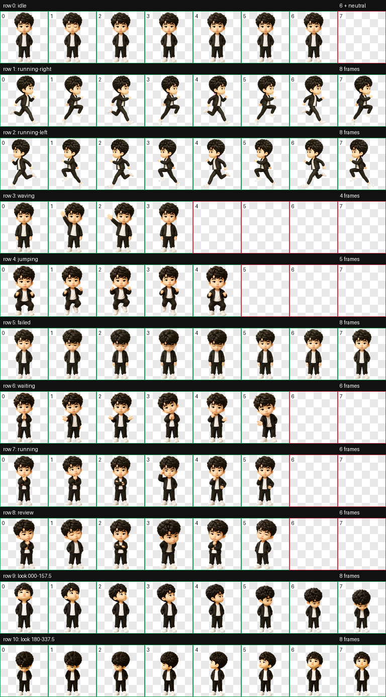
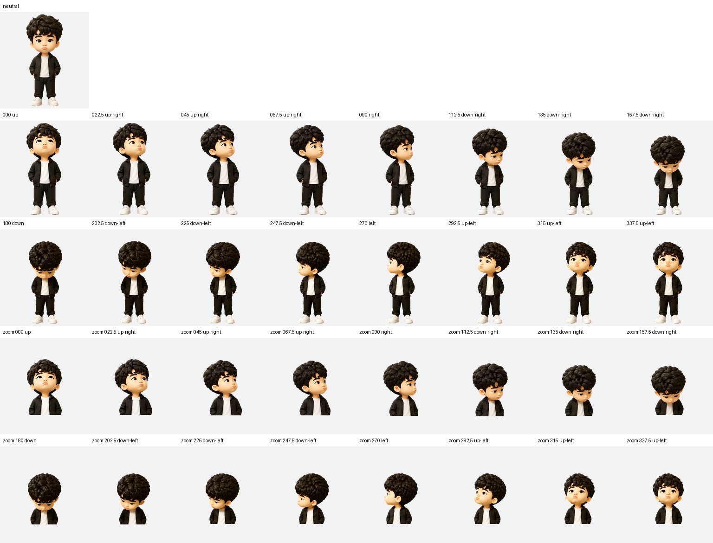
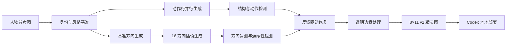

# Fengfeng AI Pet

[简体中文](README.md) | [English](README_EN.md)

一个从单张人物参考图出发，利用多模态生成模型和 AI Agent 工作流制作、评测并部署 Codex 动态桌宠的工程化项目。

> 项目定位：多模态生成式 AI、Agent 编排、自动化图像处理与质量评测。原始人物照片和生成失败样本未纳入公开仓库。



## 项目成果

- 将单张人物参考图转换为身份特征稳定的 3D Q 版角色。
- 生成 9 组标准状态动画：待机、左右跑步、挥手、跳跃、失败、等待、工作中和结果复核。
- 构建覆盖 360° 的 16 个视线方向，包含 4 个基准方向和 12 个斜向过渡。
- 输出符合 Codex Pet v2 规范的 `8 × 11` 精灵图，尺寸为 `1536 × 2288`，支持透明背景。
- 建立“生成—检测—反馈—重生成”闭环，修复角色漂移、步态重复、方向反转和闭环跳帧等问题。
- 使用 3 个独立 Agent 进行无标签方向盲测，再通过独立视觉终检复核边界角度。
- 完成 WebP 打包、配置文件生成和本地一键安装。

## 动画预览

| 待机 | 向右跑步 | 挥手 |
| --- | --- | --- |
|  |  |  |

| 跳跃 | 等待 | 失败反馈 |
| --- | --- | --- |
|  |  |  |

## 16 方向控制



方向从 `000°` 正上方开始，按顺时针依次经过 `090°` 右、`180°` 下、`270°` 左，并以 `337.5° → 000°` 完成闭环。

## 系统流程



### 1. 身份约束

从参考图中提取发型、脸部轮廓、眉眼、服装和表情等稳定特征，先生成统一角色基准，再将该基准作为后续所有动作的身份锚点。

### 2. 动作与方向生成

把标准动作拆分为独立任务，通过布局模板固定帧数量、安全边距和角色基线。视线方向先生成上、右、下、左四个基准，再补齐 12 个中间方向。

### 3. 反馈式修复

对失败结果保留诊断证据，并将具体错误转换为下一轮生成约束。例如，跑步动画要求严格的 A/B 步态交替；方向动画要求水平分量、垂直分量和闭环连续性同时成立。

### 4. 多 Agent 质量评测

方向图片会被随机重排并隐藏标签，交给 3 个独立 Agent 判断左右和上下语义。硬性基准方向必须全部通过，边界斜向由最终视觉检查员在正常显示尺寸下复核。


## 本地验证

环境要求：Python 3.10+。

```bash
python -m venv .venv
source .venv/bin/activate
pip install -r requirements.txt
python scripts/validate_pet.py
```

验证脚本会检查元数据、图集尺寸、透明通道、每个有效动画单元格和空白占位单元格。

## 安装到 Codex

```bash
python scripts/install_pet.py
```

如果本地已经存在同名宠物，可显式覆盖：

```bash
python scripts/install_pet.py --force
```

重新打开 Codex 后，在设置中的 Pets / 桌宠列表选择“峰峰”。

## 项目结构

```text
fengfeng-ai-pet/
├── assets/                 # 动画、方向和接触表预览
├── pet/fengfeng/           # Codex 可直接加载的成品
│   ├── pet.json
│   └── spritesheet.webp
├── qa/summary.json         # 脱敏后的质量评测摘要
├── scripts/
│   ├── install_pet.py      # 本地安装工具
│   └── validate_pet.py     # 结构与透明通道检查
├── requirements.txt
└── README.md

## 上游项目与许可

项目格式基于 [awesome-codex-pet](https://github.com/legeling/awesome-codex-pet) 的 Codex Pet v2 规范。

- 本仓库中的 Python 代码和文档使用 MIT License。
- 桌宠图像、精灵图和动画预览使用 CC BY-NC 4.0，仅限非商业用途。
- 桌宠角色由用户提供的私人参考图经 AI 生成；原始参考图未公开。
