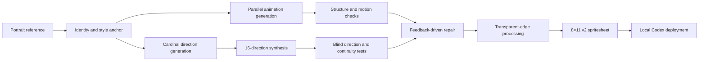

# Fengfeng AI Pet

[简体中文](README.md) | [English](README_EN.md)

An engineering project that turns a single portrait reference into a generated, evaluated, and deployable Codex animated desktop pet through a multimodal AI and multi-agent workflow.

> Focus: multimodal generative AI, agent orchestration, automated image processing, and quality evaluation. The original portrait and failed generation samples are intentionally excluded from this public repository.


## Outcomes

- Converted one portrait reference into an identity-consistent 3D chibi character.
- Produced 9 standard animation states: idle, running left, running right, waving, jumping, failure, waiting, active work, and result review.
- Built 16 look directions covering the full 360-degree loop, including 4 cardinal anchors and 12 intermediate directions.
- Packaged an `8 × 11`, `1536 × 2288` transparent spritesheet compatible with the Codex Pet v2 specification.
- Designed a generation–detection–feedback–regeneration loop to repair identity drift, duplicated gait poses, reversed directions, and loop discontinuities.
- Used 3 independent agents for label-free direction testing, followed by a separate final visual reviewer for boundary cases.
- Added WebP packaging, metadata generation, automated validation, and local installation.

## Animation Preview

| Idle | Run Right | Wave |
| --- | --- | --- |
|  |  |  |

| Jump | Wait | Failure Feedback |
| --- | --- | --- |
|  |  |  |

## 16-Direction Control


The sequence starts at `000°` (up), moves clockwise through `090°` (right), `180°` (down), and `270°` (left), then closes the loop from `337.5°` back to `000°`.

## Pipeline



### 1. Identity Grounding

Stable traits such as hairstyle, face shape, eyes, clothing, and expression are extracted from the reference. A canonical character image is generated first and reused as the identity anchor for every animation state.

### 2. Motion and Direction Generation

Each animation state is handled as an independent task. Layout guides constrain frame count, safe margins, spacing, and character baseline. Look directions are synthesized from four approved cardinal anchors before filling the twelve intermediate angles.

### 3. Feedback-Driven Repair

Failed outputs are retained as diagnostic evidence, and their visible errors are translated into constraints for the next generation pass. Running requires strict A/B gait alternation, while direction rows must satisfy horizontal meaning, vertical meaning, and loop continuity at the same time.

### 4. Multi-Agent Evaluation

Direction images are shuffled and stripped of labels before three independent agents classify their horizontal and vertical meaning. All cardinal hard gates must pass. A separate reviewer evaluates ambiguous diagonal components at normal display size.

### 5. Engineering and Packaging

Approved rows are assembled deterministically, checked for alpha integrity and chroma spill, compressed to WebP, and packaged with metadata that Codex can load directly.

## Quality Results

| Check | Result |
| --- | --- |
| Atlas structure | `1536 × 2288`, 8 columns, 11 rows — passed |
| Codex specification | `spriteVersionNumber: 2` — passed |
| Standard animations | All 9 states passed visual review |
| Direction semantics | All 4 cardinal blind-test hard gates passed |
| Running gait | Strict A/B alternation in both directions |
| Transparent edges | No visible blue spill or alpha holes |
| Transparent RGB residue | 0 pixels |
| Independent final visual QA | Passed with no blocking defects |

The sanitized evaluation report is available at [`qa/summary.json`](qa/summary.json).

## Local Validation

Requirements: Python 3.10+.

```bash
python -m venv .venv
source .venv/bin/activate
pip install -r requirements.txt
python scripts/validate_pet.py
```

The validator checks metadata, atlas dimensions, the alpha channel, all used animation cells, and all required blank placeholder cells.

## Install into Codex

```bash
python scripts/install_pet.py
```

To replace an existing local pet with the same ID:

```bash
python scripts/install_pet.py --force
```

Restart Codex and select “峰峰” under Settings → Pets.

## Repository Layout

```text
fengfeng-ai-pet/
├── assets/                 # Animation, direction, and contact-sheet previews
├── pet/fengfeng/           # Directly loadable Codex pet package
│   ├── pet.json
│   └── spritesheet.webp
├── qa/summary.json         # Sanitized evaluation summary
├── scripts/
│   ├── install_pet.py      # Local installation utility
│   └── validate_pet.py     # Structure and alpha-channel validation
├── requirements.txt
└── README.md
```

## AI Engineering Skills Demonstrated

- Reference-grounded multimodal generation and prompt engineering
- Multi-stage AI agent decomposition and orchestration
- Automated evaluation and feedback repair for generative models
- Multi-agent blind testing and evaluator-bias reduction
- Alpha-channel processing, spritesheet assembly, and client deployment

This project focuses on applied generative AI engineering. It does not claim to train or fine-tune a foundation model.

## Upstream Project and Licensing

The package format follows the Codex Pet v2 specification from [awesome-codex-pet](https://github.com/legeling/awesome-codex-pet).

- Python code and documentation in this repository are licensed under the MIT License.
- Pet artwork, spritesheets, and generated previews are licensed under CC BY-NC 4.0 for non-commercial use.
- The pet was AI-generated from a private user-provided portrait. The original portrait is not included.

